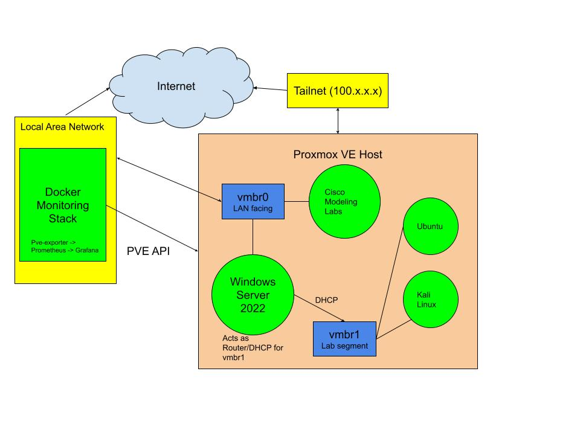

# Proxmox Home Lab Infrastructure

Infrastructure-as-code (IaC) for my Proxmox VE home lab: Ansible playbooks for host and
VM management, plus a Docker-based Prometheus/Grafana stack for remote monitoring.

The lab runs Proxmox on a spare laptop as a Type-1 hypervisor, hosting Windows
Server 2022 (Active Directory + DHCP), Cisco Modeling Labs, Kali Linux, and Ubuntu
VMs. The host sits on a Tailscale network rather than being exposed to the
internet, which is what lets me manage and monitor it remotely and lets my website's Kubernetes cluster scrape its metrics.

> There's a full write-up of the project — objectives, process, challenges, and
> what I learned — on my site:
> **[Home Lab Server](https://seanslab.site/projects/home-lab-server/)**.

---

## Architecture


---

## Repository layout

```
├── ansible/
│   ├── ansible.cfg
│   ├── inventories/
│   │   └── inventory                   # Proxmox host
│   └── playbooks/
│       ├── pve_onboard.yml             # create automation user
│       ├── pve_install_proxmoxer.yml   # install the proxmoxer library
│       └── pve_create_vm.yml           # create a VM through Proxmox API
└── docker/
    ├── docker-compose.yml              # Prometheus + Grafana + PVE exporter
    └── prometheus/
        ├── prometheus.yml              # scrape config for the PVE exporter
        └── pve/pve.yml                 # PVE exporter credentials (gitignored)
```

---

## Ansible

Playbooks that automate managing the Proxmox host and its VMs, so the same setup
can be reproduced on a stronger machine later. Credentials live in an
ansible-vault–encrypted `secrets.yml` (not in repo).

| Playbook | What it does |
|----------|--------------|
| `pve_onboard.yml` | Creates automation user with an SSH key |
| `pve_install_proxmoxer.yml` | Installs the proxmoxer library  |
| `pve_create_vm.yml` | Creates a VM through Proxmox API. |

---

## Monitoring stack

A Docker Compose stack that scrapes Proxmox metrics and visualizes them, so I can
watch the server without logging into the Proxmox web UI.

| Service | Role |
|---------|------|
| `pve-exporter` | Pulls metrics from the Proxmox API in Prometheus format |
| `prometheus` | Scrapes and stores the metrics over time |
| `grafana` |  Dashboards over the Prometheus data |

Credential files are kept out of the repo (gitignored):

- `docker/.env` — Grafana admin login
- `docker/prometheus/pve/pve.yml` — PVE exporter auth

---

## Status

Last updated **August 2026**.

- Proxmox host, Windows Server 2022 (AD + DHCP), and client VMs running
- Prometheus / Grafana / PVE-exporter monitoring live
- Ansible automation partially built — onboarding, proxmoxer install, and a
  minimal VM-create playbook are done

Next: cloud-init template builder, clone-from-template, and teardown playbooks
to complete a full IaC pipeline for provisioning and tearing down VMs.
